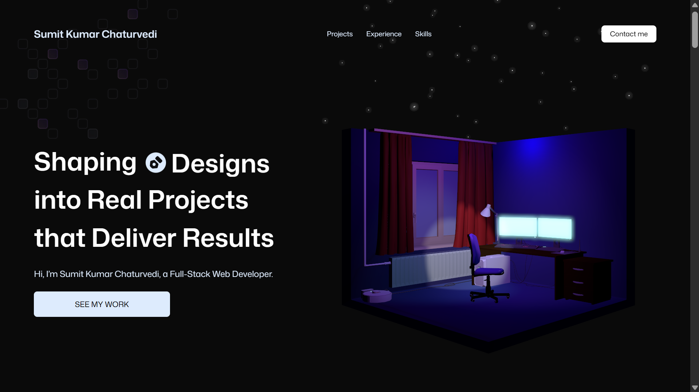
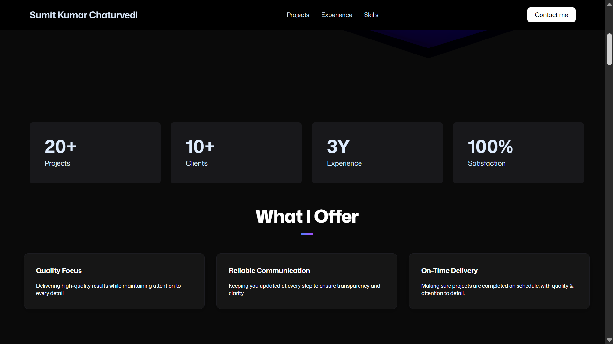
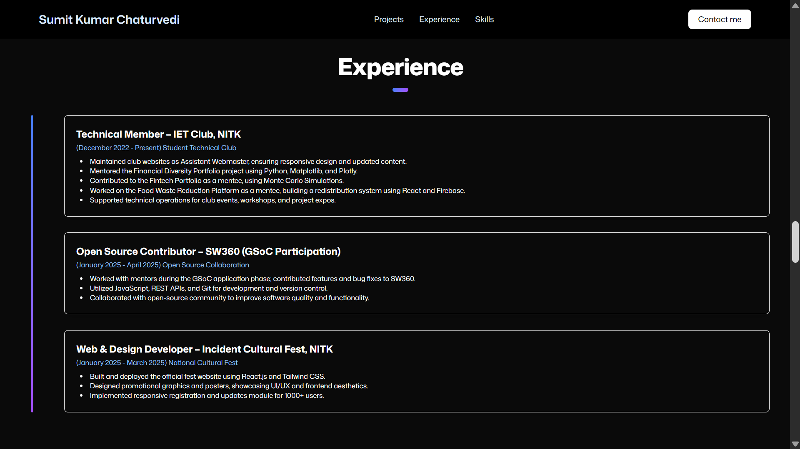
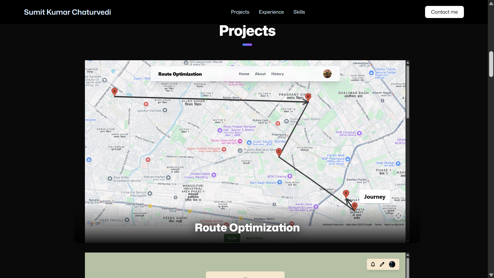
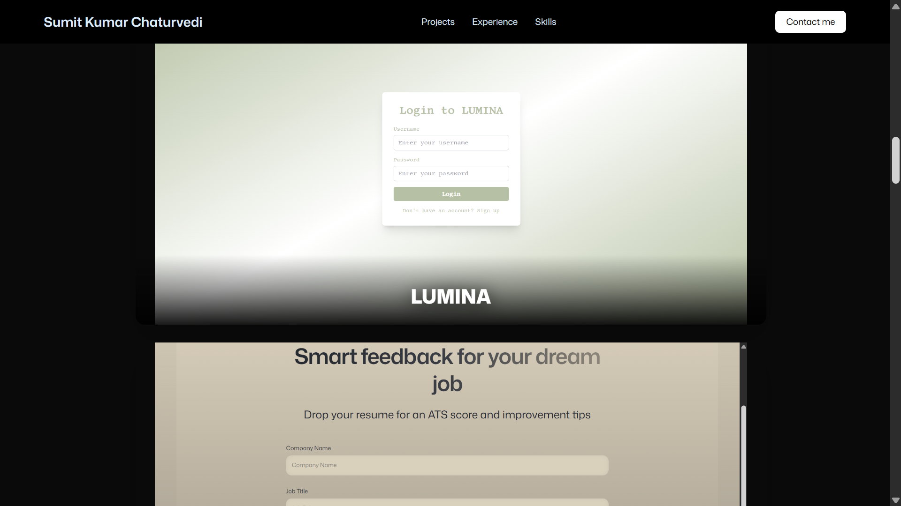
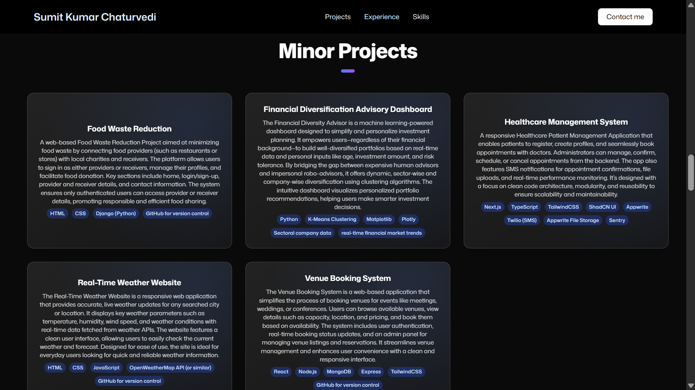
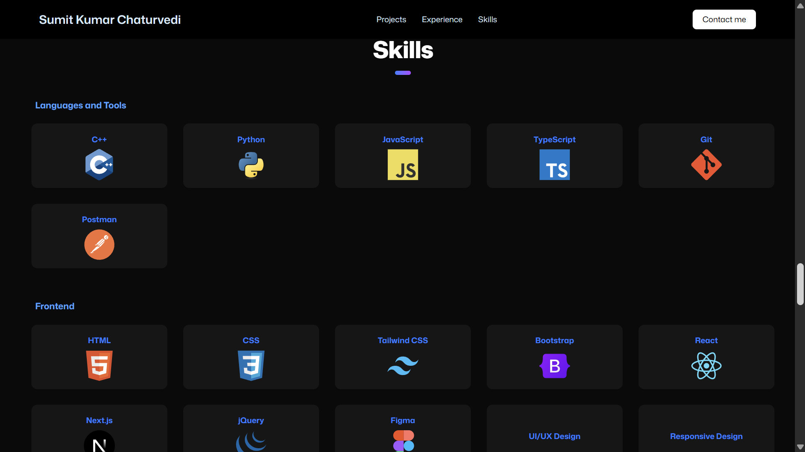
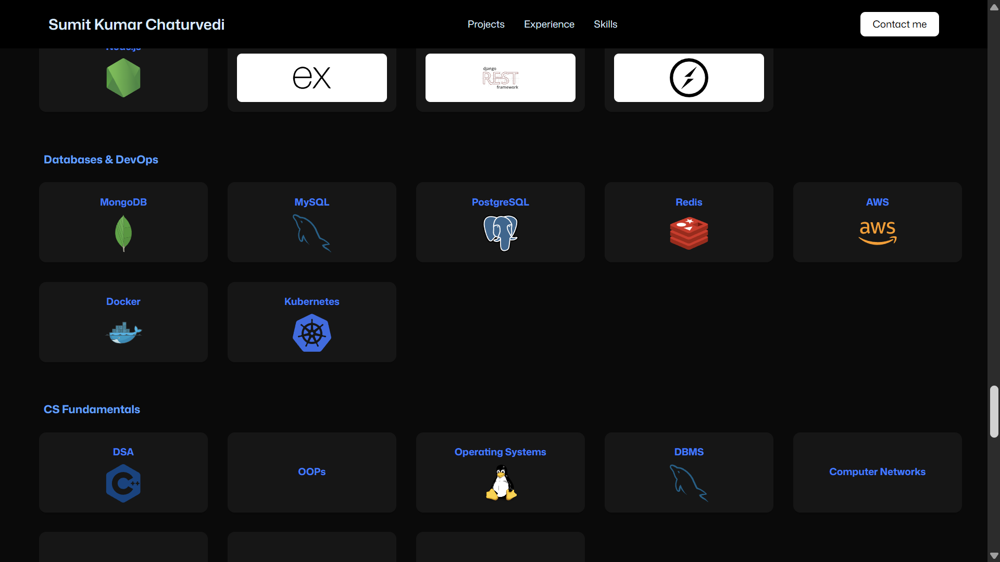
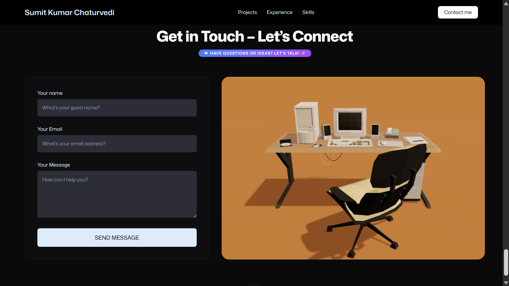

# 🚀 3D Portfolio - Sumit Kumar Chaturvedi

<div align="center">
  
  
  <br/>
  
  <div>
    
    
    
    
    
  </div>
  
  <h3 align="center">Interactive 3D Portfolio Website</h3>
  <p align="center">A modern, responsive portfolio showcasing full-stack development skills with immersive 3D experiences</p>
</div>

## 🖼️ Portfolio Gallery
<div align="center">

<table>
  <tr>
    <td align="center"><br/><b>Intro Section</b></td>
    <td align="center"><br/><b>About Section</b></td>
    <td align="center"><br/><b>Experience Section</b></td>
  </tr>
  <tr>
    <td align="center"><br/><b>Projects Section 1</b></td>
    <td align="center"><br/><b>Projects Section 2</b></td>
    <td align="center"><br/><b>Minor Projects</b></td>
  </tr>
  <tr>
    <td align="center"><br/><b>Skills Section 1</b></td>
    <td align="center"><br/><b>Skills Section 2</b></td>
    <td align="center"><br/><b>Contact Section</b></td>
  </tr>
</table>

</div>
## 📋 Table of Contents

- [✨ Features](#-features)
- [🛠️ Tech Stack](#️-tech-stack)
- [🚀 Live Demo](#-live-demo)
- [📦 Installation](#-installation)
- [🎯 Project Structure](#-project-structure)
- [🌟 Key Projects](#-key-projects)
- [💼 Experience](#-experience)
- [🛠️ Skills](#️-skills)
- [📞 Contact](#-contact)

## ✨ Features

- **🎨 Immersive 3D Experience**: Interactive 3D models and animations using Three.js and React Three Fiber
- **📱 Fully Responsive**: Optimized for all devices with mobile-first design
- **⚡ Smooth Animations**: GSAP-powered scroll animations and micro-interactions
- **🎯 Project Showcase**: Dynamic project carousel with multiple screenshots
- **📊 Interactive Elements**: Animated counters, tilt effects, and hover animations
- **📧 Contact Integration**: EmailJS-powered contact form
- **🌙 Modern Design**: Dark theme with gradient effects and glass morphism
- **⚙️ Performance Optimized**: Vite build system for fast development and production

## 🛠️ Tech Stack

### Frontend
- **React 19** - Modern React with latest features
- **Three.js** - 3D graphics and animations
- **React Three Fiber** - React renderer for Three.js
- **GSAP** - Professional-grade animations
- **Tailwind CSS** - Utility-first CSS framework
- **Vite** - Fast build tool and dev server

### 3D & Graphics
- **@react-three/drei** - Useful helpers for React Three Fiber
- **@react-three/postprocessing** - Post-processing effects
- **Three.js GLB Models** - Optimized 3D assets

### Development Tools
- **ESLint** - Code linting and formatting
- **TypeScript** - Type safety and better development experience

## 🚀 Live Demo

[View Live Portfolio](https://your-portfolio-url.com) *(Replace with actual deployment URL)*

## 📦 Installation

### Prerequisites
- Node.js (v18 or higher)
- npm or yarn

### Setup Instructions

1. **Clone the repository**
   ```bash
   git clone https://github.com/yourusername/3d-portfolio.git
   cd 3d-portfolio
   ```

2. **Install dependencies**
   ```bash
   npm install
   ```

3. **Set up environment variables**
   Create a `.env` file in the root directory:
   ```env
   VITE_APP_EMAILJS_SERVICE_ID=your_service_id
   VITE_APP_EMAILJS_TEMPLATE_ID=your_template_id
   VITE_APP_EMAILJS_PUBLIC_KEY=your_public_key
   ```

4. **Run the development server**
   ```bash
   npm run dev
   ```

5. **Open your browser**
   Navigate to `http://localhost:5173`

## 🎯 Project Structure

```
src/
├── components/          # Reusable UI components
│   ├── models/         # 3D model components
│   ├── AnimatedCounter.jsx
│   ├── Button.jsx
│   ├── NavBar.jsx
│   └── TitleHeader.jsx
├── sections/           # Main page sections
│   ├── Hero.jsx       # Landing section with 3D models
│   ├── ShowcaseSection.jsx  # Featured projects
│   ├── Experience.jsx # Work experience
│   ├── TechStack.jsx  # Skills and technologies
│   ├── Contact.jsx    # Contact form
│   └── Footer.jsx     # Footer section
├── constants/          # Data and configuration
└── index.css          # Global styles
```

## 🌟 Key Projects

### 🛣️ Route Optimization System
- **Description**: Advanced route optimization platform with real-time traffic analysis
- **Tech Stack**: React, Node.js, MongoDB, Express
- **Features**: Dynamic routing, traffic integration, user management

### 💡 LUMINA - Social Platform
- **Description**: Full-featured social media platform with real-time interactions
- **Tech Stack**: React, Node.js, WebSockets, MongoDB
- **Features**: User authentication, real-time messaging, profile management

### 🧠 SAGE - AI-Powered System
- **Description**: Intelligent system with AI-driven features and analytics
- **Tech Stack**: React, Python, Machine Learning APIs
- **Features**: AI integration, data visualization, predictive analytics

### 🏥 Healthcare Management System
- **Description**: Comprehensive patient management application
- **Tech Stack**: Next.js, TypeScript, Appwrite, Twilio
- **Features**: Appointment booking, SMS notifications, file management

### 🍽️ Food Waste Reduction Platform
- **Description**: Web-based platform connecting food providers with charities
- **Tech Stack**: Django, Python, HTML, CSS
- **Features**: User authentication, donation management, real-time updates

## 💼 Experience

### Technical Member – IET Club, NITK
*December 2022 - Present*
- Maintained club websites with responsive design
- Mentored Financial Diversity Portfolio project using Python and data visualization
- Contributed to Fintech Portfolio with Monte Carlo Simulations
- Built Food Waste Reduction Platform using React and Firebase

### Open Source Contributor – SW360 (GSoC Participation)
*January 2025 - April 2025*
- Contributed features and bug fixes to SW360 open-source project
- Utilized JavaScript, REST APIs, and Git for development
- Collaborated with open-source community

### Web & Design Developer – Incident Cultural Fest, NITK
*January 2025 - March 2025*
- Built and deployed official fest website using React.js and Tailwind CSS
- Designed promotional graphics and posters
- Implemented responsive registration system for 1000+ users

## 🛠️ Skills

### Languages & Tools
- **C++**, **Python**, **JavaScript**, **TypeScript**
- **Git**, **Postman**

### Frontend Development
- **HTML5**, **CSS3**, **Tailwind CSS**, **Bootstrap**
- **React**, **Next.js**, **jQuery**
- **Figma**, **UI/UX Design**, **Responsive Design**

### Backend & APIs
- **Node.js**, **Express**, **REST APIs**, **WebSockets**

### Databases & DevOps
- **MongoDB**, **MySQL**, **PostgreSQL**, **Redis**
- **AWS**, **Docker**, **Kubernetes**

### Computer Science Fundamentals
- **Data Structures & Algorithms**, **Object-Oriented Programming**
- **Operating Systems**, **Database Management Systems**
- **Computer Networks**, **System Design**, **Microservices**

## 📞 Contact

- **LinkedIn**: [Sumit Kumar Chaturvedi](https://linkedin.com/in/your-profile)
- **Email**: [your.email@example.com](mailto:your.email@example.com)
- **Portfolio**: [Live Website](https://your-portfolio-url.com)

---

<div align="center">
  <p>⭐ Star this repository if you found it helpful!</p>
  <p>Made with ❤️ by Sumit Kumar Chaturvedi</p>
</div>


